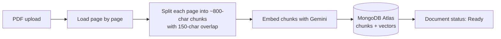
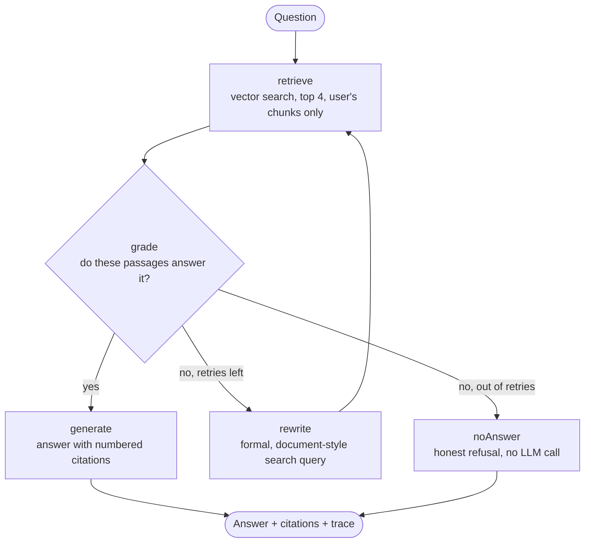

# Folio: Agentic Document Q&A with Page Citations

Upload PDFs, ask questions in plain English, and get answers that come **only** from your documents, with every fact linked to the exact page it came from.

Behind each answer is a small **LangGraph agent**: it searches your documents, checks whether what it found actually answers the question, rewrites the search and tries again if it didn't, and refuses honestly when the answer isn't there. The UI shows each of those steps, so you can see how every answer was found.

<!-- Add screenshots here, e.g.  -->

---

## Features

- **Grounded answers with page citations.** Every fact carries a tag like `p.6`; clicking it opens the exact source passage.
- **Self-correcting retrieval.** An agent grades retrieved passages, rewrites weak searches into document-style wording, and retries (at most twice) before giving up.
- **Honest refusals.** If your documents don't contain the answer, it says so instead of guessing.
- **Code-enforced grounding.** Answers without valid citations are retried once and otherwise rejected.
- **Visible reasoning.** A "Behind this answer" timeline replays what the agent did: searched, rewrote, found, answered.
- **Multi-document search.** Search everything, or limit questions to one document.
- **Per-user data isolation.** Every search is filtered by the user ID from the verified JWT, so users can never see each other's documents.
- **Background ingestion with live status.** Uploads return immediately; documents move from *Reading* to *Ready* (or *Failed* with a reason) while the UI polls.
- **Evaluation harness.** A 25-question test set compares plain RAG with the agent on retrieval, answer accuracy, citation accuracy and refusals.

## Tech stack

| Layer | Technology |
|---|---|
| Frontend | React 19, Vite, Motion (animations), plain CSS with design tokens |
| Backend | Node.js 22, Express 5, Mongoose 9 |
| Auth | JWT (7-day tokens), bcrypt password hashing |
| Database + vector search | MongoDB Atlas with Atlas Vector Search |
| RAG pipeline | LangChain.js (PDF loader, text splitter, vector store) |
| Agent | LangGraph.js |
| Embeddings | Google `gemini-embedding-001` (3072 dimensions) |
| LLMs (via Groq) | `openai/gpt-oss-120b` for answers, `openai/gpt-oss-20b` for grading and query rewriting |

## How it works

### 1. Ingestion (upload time)



- Pages are split **separately**, so a chunk never mixes two pages and every chunk keeps an exact page number for citations.
- Each chunk stores its text, its 3072-number embedding, and metadata (`userId`, `documentId`, `fileName`, `pageNumber`).
- Processing runs in the background. The document's `status` field (`processing` → `ready` / `failed`) drives the UI, and a startup check marks any document interrupted by a server restart as failed instead of leaving it stuck.
- If any step fails, partially saved chunks are deleted, so a document is either fully searchable or not at all.

### 2. Answering (question time): the agent



- **retrieve:** embeds the search query and runs `$vectorSearch` (cosine similarity, top 4), filtered by the user ID from the JWT and optionally by one document.
- **grade:** a cheap score floor first, then a small, fast model answers a narrow YES/NO question: "Do these passages contain the answer?"
- **rewrite:** turns casual wording ("how long do I stay after I quit?") into document language ("employee notice period resignation"). The rewritten query is used **only** for searching; the answer always targets the user's original question.
- **generate:** a larger model answers from numbered sources only. Citations like `[1]` are mapped to file and page **in code**, never trusted from the model, and invalid labels are dropped.
- **Citation guard:** an answer with no valid citations gets one retry with a reminder, and is otherwise replaced with "I couldn't find this in your documents."
- **Loop safety:** at most 2 rewrites (3 searches), plus LangGraph's recursion limit as a second safety net.

## Evaluation

`server/eval/runEval.js` runs a fixed 25-question set through both **plain RAG** (one search, one answer) and the **agent**, using the real application code:

- 20 answerable questions across two documents, written in a mix of formal and casual wording
- 5 questions whose answers are **not** in the documents, where the correct behaviour is to refuse
- Each answer is scored on: right page retrieved, key fact present in the answer, right page cited, and correct refusal

**Results (latest run):**

| Metric | Plain RAG | Agent |
|---|---|---|
| Right page retrieved | 100% | 100% |
| Correct answer | 100% | 100% |
| Right page cited | 100% | 100% |
| Refused when not in documents | 100% | 100% |
| Average seconds per question | 2.8 | 3.7 |

**What the evaluation found.** The first run scored only **20% citation accuracy** for plain RAG and rejected correct agent answers. The cause: the `gpt-oss` models sometimes write citations as `【1】` or `【2†L1-L3】` instead of `[1]`, which the parser didn't recognise, so the citation guard rejected valid answers. After normalising the model's citation format at a single point, citation accuracy rose to 100%. The run also hit Groq's tokens-per-minute limit, fixed with pacing and retry-on-429 in the evaluation script.

**Honest reading of the numbers.** On this set, both systems reach 100%, so the test set is too easy to separate them. The agent only retried on the 5 out-of-scope questions, and costs about 0.9 seconds more per question. Its retry loop should matter more with vaguer questions, messier documents, or larger document collections, which is the next thing to test. The set is small (25 questions, 2 documents) and written by the author, so treat the numbers as a signal, not a benchmark. Full per-question results are saved in `server/eval/results/`.

## Security and reliability decisions

- **User isolation by construction:** the `userId` used in every vector search comes from the verified JWT, never from the request body. The LLM can influence the search *query*, but never *whose* documents are searched.
- **Prompt-injection defence:** both the answer and grader prompts state that document text is data, not instructions.
- **Safe rendering:** answers are split and rendered as React text, never injected as HTML, so text from uploaded PDFs can't run scripts in the browser.
- **No information leaks in errors:** only errors explicitly marked as user-facing are shown; provider errors (bad model name, quota) become generic messages, and rate limits become a friendly 503.
- **Enumeration-safe auth:** login gives the same message for an unknown email and a wrong password; deleting someone else's document returns 404, not 403.
- **Safe deletes:** a document's chunks are deleted before its record, and deletion is blocked while it is still processing.
- **Input limits:** PDFs only, 10 MB maximum, questions up to 1,000 characters, `documentId` type-checked against NoSQL injection.
- **Centralised model config:** all models are created once in `server/src/config/ai.js`, which made it a one-file change to switch LLM providers mid-build when a free-tier quota ran out.

## Project structure

```
doc-qa-agents/
├── client/                         React frontend (Vite)
│   └── src/
│       ├── api.js                  all API calls + session storage
│       ├── App.jsx                 login screen or workspace
│       ├── styles/                 design tokens + base styles
│       ├── hooks/useDocuments.js   upload, list, delete, status polling
│       ├── utils/traceToSteps.js   agent trace → timeline steps
│       └── components/             one folder per component (.jsx + .css)
│           ├── AuthScreen/  Workspace/  Shelf/  DocumentFolder/
│           ├── Desk/  AnswerSheet/  AgentTrail/
│           └── Background/  Brand/
└── server/                         Express API
    ├── src/
    │   ├── server.js               app setup, routes, error handler, startup recovery
    │   ├── config/                 db.js (MongoDB), ai.js (models)
    │   ├── models/                 User, Document
    │   ├── middleware/             requireAuth (JWT), upload (multer)
    │   ├── controllers/            auth, documents, ask
    │   ├── routes/                 /api/auth, /api/documents, /api/ask
    │   ├── services/
    │   │   ├── ingestionService.js PDF → chunks → embeddings → MongoDB
    │   │   └── ragService.js       retrieval, prompt, generation, citations
    │   └── agent/qaAgent.js        the LangGraph agent
    └── eval/                       test questions, evaluation script, results
```

## Getting started

### Prerequisites

- Node.js **22.12 or newer** (the server uses Node's built-in `--env-file`)
- A **MongoDB Atlas** cluster (the free M0 tier works)
- A **Google AI Studio** API key (for embeddings)
- A **Groq** API key (for the LLMs)

### 1. Clone and install

```bash
git clone https://github.com/Sahil124-prog/doc-qa-agents.git
cd doc-qa-agents

cd server && npm install
cd ../client && npm install
```

### 2. Configure the server

Create `server/.env`:

```
PORT=5050
MONGODB_URI=mongodb+srv://<user>:<password>@<cluster>.mongodb.net/?retryWrites=true&w=majority
JWT_SECRET=<a long random string>
GEMINI_API_KEY=<your Google AI Studio key>
GROQ_API_KEY=<your Groq key>
```

Generate a strong `JWT_SECRET` with:

```bash
node -e "console.log(require('crypto').randomBytes(32).toString('hex'))"
```

The app always uses the `docqa` database (set in `server/src/config/db.js`). In Atlas, allow your IP under **Network Access**.

### 3. Create the vector search index

Upload one PDF first (so the `chunks` collection exists), then in Atlas: **Collections → `docqa.chunks` → Search Indexes → Create Search Index → Vector Search → "Bring your own embeddings" → JSON Editor**, name it `vector_index`, and paste:

```json
{
  "fields": [
    { "type": "vector", "path": "embedding", "numDimensions": 3072, "similarity": "cosine" },
    { "type": "filter", "path": "userId" },
    { "type": "filter", "path": "documentId" }
  ]
}
```

`numDimensions` must match the embedding model's output (3072 for `gemini-embedding-001`).

### 4. Run

In two terminals:

```bash
# Terminal 1
cd server
npm run dev        # nodemon, restarts on changes in src/

# Terminal 2
cd client
npm run dev        # Vite on http://localhost:5173, proxies /api to port 5050
```

Open http://localhost:5173, create an account, upload a PDF, and ask away.

### 5. Run the evaluation (optional)

Edit `server/eval/questions.json` so the file names and pages match your own documents, then:

```bash
cd server
node --env-file=.env eval/runEval.js <your-login-email>
```

It takes 10 to 15 minutes on free-tier rate limits and saves a full report to `server/eval/results/`.

## API

All routes except signup and login need `Authorization: Bearer <token>`.

| Method | Route | Description |
|---|---|---|
| POST | `/api/auth/signup` | Create an account, returns `{ token, user }` |
| POST | `/api/auth/login` | Log in, returns `{ token, user }` |
| GET | `/api/auth/me` | Current user |
| POST | `/api/documents` | Upload a PDF (`multipart/form-data`, field `file`); processing continues in the background |
| GET | `/api/documents` | List your documents with status, page and passage counts |
| DELETE | `/api/documents/:id` | Delete a document and all of its chunks |
| POST | `/api/ask` | `{ question, documentId? }` → `{ answer, citations, sources, searchQueries, retries, trace }` |

## Development scripts

The `server/test-*.js` scripts were used to build and check each stage on its own (Gemini connection, ingestion, vector search, RAG, agent). Run any of them with `node --env-file=.env <script>` from the `server` folder. Some contain a hard-coded user ID and need editing before use.

## Limitations and next steps

- **Background jobs live in memory.** A server restart interrupts processing (the document is marked failed and must be re-uploaded). A job queue such as BullMQ with Redis would make this durable.
- **Text PDFs only.** Scanned PDFs have no text layer and fail with a clear message; OCR would be needed.
- **Duplicate uploads** are stored twice. Hashing file contents would detect and reject duplicates.
- **Answer checking is keyword-based.** An LLM-as-judge evaluation would also catch answers that cite the right page but add unsupported details.
- **Harder evaluation set.** Vaguer questions, more documents and a smaller top-K are needed to measure when the agent's retry loop actually beats plain RAG.
- **Streaming responses** would show the answer as it's written instead of after the full agent run.
- **Token storage** uses `localStorage` for simplicity; httpOnly cookies would protect against token theft via XSS.

## Author

**Sahil**, [github.com/Sahil124-prog](https://github.com/Sahil124-prog)